# Conception - Cas d'Usage - Emplois Maroc

## Vue d'ensemble

Ce document contient la documentation orientée cas d'usage pour le projet Emplois Maroc. Chaque cas d'usage suit la structure standard UML et inclut des diagrammes Mermaid pour visualiser les interactions et les états.

---

## UC-001: Consulter la page d'accueil

### Metadata
- **ID**: UC-001
- **Name**: Consulter la page d'accueil
- **Priority**: High
- **Status**: Completed
- **Servlet**: IndexServlet

### Actors
- **Primary Actor**: Visiteur, Candidat
- **Secondary Actors**: Système

### Description
Le visiteur accède à la page d'accueil du site pour découvrir les offres d'emploi disponibles. La page affiche une liste paginée des dernières offres et les régions disponibles.

### Preconditions
1. L'application est démarrée et accessible
2. La base de données contient des offres d'emploi

### Postconditions
1. La page d'accueil est affichée avec succès
2. Les offres d'emploi sont affichées (maximum 8 par défaut)
3. Les régions sont listées

### Main Success Scenario
1. L'utilisateur accède à l'URL "/" ou ""
2. Le système récupère les 8 premières offres d'emploi
3. Le système récupère la liste des régions
4. Le système affiche la page d'accueil avec les données

### Alternative Scenarios
- **A1**: Aucune offre disponible → La page s'affiche avec un message approprié
- **A2**: Erreur de base de données → Page d'erreur 500 affichée

### Business Rules
- BR-001: Par défaut, 8 offres sont affichées sur la page d'accueil
- BR-002: Seules les offres actives sont affichées
- BR-003: Les offres sont triées par date de création (plus récentes en premier)

### Diagrams

#### Use Case Diagram


#### Collaboration Diagram
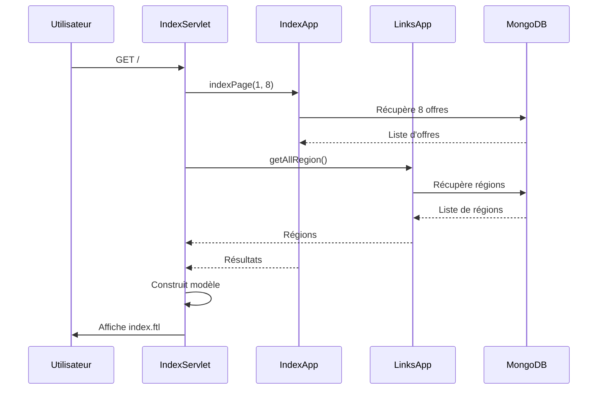

### Related Use Cases
- Extends: UC-002 (Rechercher par domaine)
- Extends: UC-003 (Rechercher par région)

---

## UC-002: Rechercher des offres d'emploi par domaine

### Metadata
- **ID**: UC-002
- **Name**: Rechercher des offres d'emploi par domaine
- **Priority**: High
- **Status**: Completed
- **Servlet**: CategoryServlet, CategoryByDomainServlet

### Actors
- **Primary Actor**: Candidat
- **Secondary Actors**: Système

### Description
Le candidat recherche des offres d'emploi en sélectionnant un domaine professionnel (ex: Informatique, Marketing, etc.). Le système affiche toutes les offres correspondant à ce domaine.

### Preconditions
1. L'utilisateur accède à la page de recherche par domaine
2. Des domaines sont disponibles dans le système
3. Des offres existent pour au moins un domaine

### Postconditions
1. La liste des domaines est affichée OU
2. Les offres du domaine sélectionné sont affichées avec pagination

### Main Success Scenario
1. L'utilisateur accède à "/categorie"
2. Le système affiche tous les domaines disponibles
3. L'utilisateur sélectionne un domaine (ex: "/categorie/informatique")
4. Le système récupère les offres du domaine sélectionné
5. Le système affiche les résultats paginés

### Alternative Scenarios
- **A1**: Aucune offre pour le domaine → Message "Aucune offre disponible"
- **A2**: Domaine invalide → Redirection vers la liste des domaines
- **A3**: Recherche avec région → UC-003 (Rechercher par région)

### Business Rules
- BR-001: Les domaines sont affichés par ordre alphabétique
- BR-002: Seules les offres actives sont affichées
- BR-003: La pagination affiche 10 offres par page par défaut
- BR-004: Les domaines utilisent des slugs pour les URLs

### Diagrams

#### Use Case Diagram
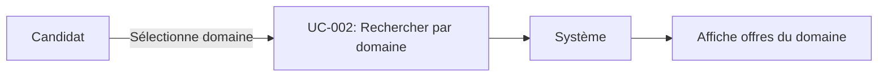

#### Collaboration Diagram
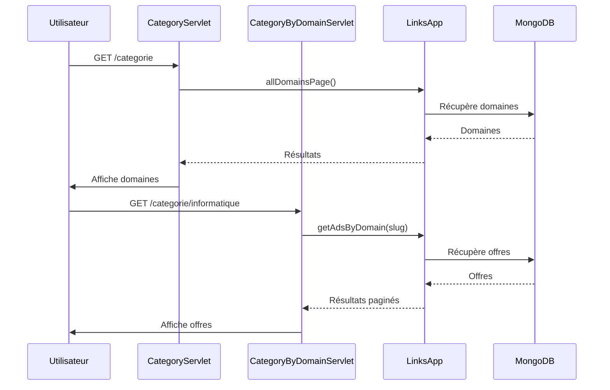

### Related Use Cases
- Includes: UC-001 (Consulter page d'accueil)
- Extends: UC-003 (Rechercher par région)
- Related: UC-004 (Consulter détail offre)

---

## UC-003: Rechercher des offres par région

### Metadata
- **ID**: UC-003
- **Name**: Rechercher des offres par région
- **Priority**: High
- **Status**: Completed
- **Servlet**: RegionServlet, RegionByCityServlet

### Actors
- **Primary Actor**: Candidat
- **Secondary Actors**: Système

### Description
Le candidat recherche des offres d'emploi en sélectionnant une région ou une ville. Le système affiche les offres correspondantes avec possibilité de filtrer par domaine.

### Preconditions
1. L'utilisateur accède à la page de recherche par région
2. Des régions sont disponibles dans le système

### Postconditions
1. La liste des régions est affichée OU
2. Les villes d'une région sont affichées OU
3. Les offres d'une région/ville sont affichées

### Main Success Scenario
1. L'utilisateur accède à "/region"
2. Le système affiche toutes les régions disponibles
3. L'utilisateur sélectionne une région (ex: "/region/casablanca-settat")
4. Le système affiche les villes principales de la région
5. L'utilisateur sélectionne une ville (ex: "/region/casablanca-settat/casablanca")
6. Le système affiche les offres de la ville avec pagination

### Alternative Scenarios
- **A1**: Recherche avec domaine → Filtrage par région ET domaine
- **A2**: Aucune offre disponible → Message approprié
- **A3**: Région invalide → Redirection vers liste des régions

### Business Rules
- BR-001: Les régions sont affichées par ordre alphabétique
- BR-002: Les villes sont triées par nombre d'offres (plus d'offres en premier)
- BR-003: La pagination affiche 10 offres par page par défaut
- BR-004: Les régions utilisent des slugs pour les URLs

### Diagrams

#### Use Case Diagram
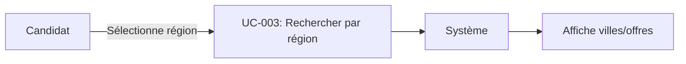

#### State Diagram
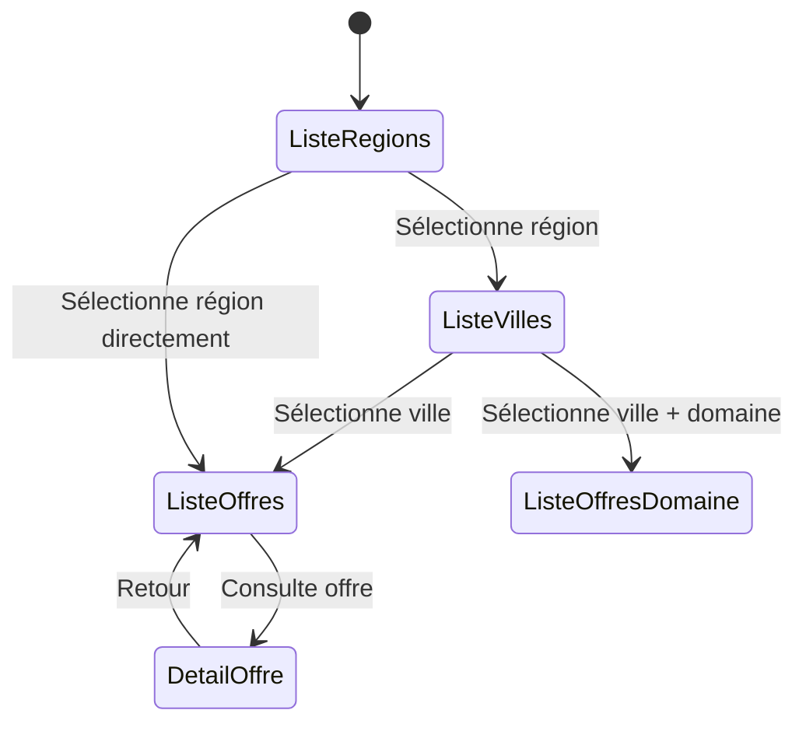

### Related Use Cases
- Includes: UC-001 (Consulter page d'accueil)
- Extends: UC-002 (Rechercher par domaine)
- Related: UC-004 (Consulter détail offre)

---

## UC-004: Consulter le détail d'une offre d'emploi

### Metadata
- **ID**: UC-004
- **Name**: Consulter le détail d'une offre d'emploi
- **Priority**: High
- **Status**: Completed
- **Servlet**: DetailOfferServlet

### Actors
- **Primary Actor**: Candidat
- **Secondary Actors**: Système

### Description
Le candidat consulte les détails complets d'une offre d'emploi pour décider s'il souhaite postuler.

### Preconditions
1. Une offre d'emploi existe dans le système
2. L'utilisateur a l'ID ou la clé de l'offre

### Postconditions
1. Les détails complets de l'offre sont affichés
2. Un bouton "Postuler" est disponible

### Main Success Scenario
1. L'utilisateur clique sur une offre depuis une liste
2. Le système récupère l'ID de l'offre depuis l'URL
3. Le système valide que l'ID est un ObjectId MongoDB valide
4. Le système récupère les détails complets de l'offre
5. Le système affiche la page de détail avec toutes les informations

### Alternative Scenarios
- **A1**: ID invalide → Page d'erreur 404
- **A2**: Offre supprimée ou inactive → Message approprié
- **A3**: Offre introuvable → Page d'erreur 404

### Business Rules
- BR-001: Seules les offres actives sont accessibles
- BR-002: L'ID doit être un ObjectId MongoDB valide (24 caractères hexadécimaux)
- BR-003: Les informations de l'entreprise sont affichées si disponibles

### Diagrams

#### Collaboration Diagram
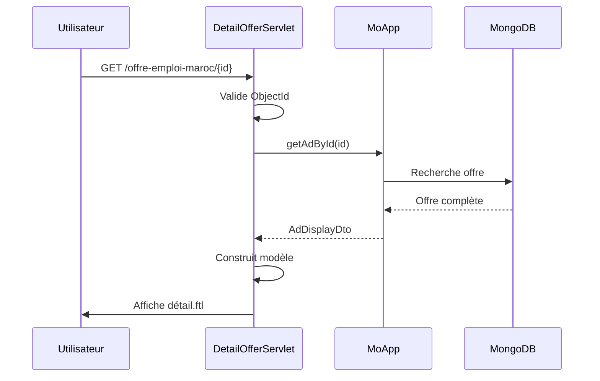

### Related Use Cases
- Includes: UC-005 (Postuler à une offre)
- Related: UC-002 (Rechercher par domaine)
- Related: UC-003 (Rechercher par région)

---

## UC-005: Postuler à une offre d'emploi

### Metadata
- **ID**: UC-005
- **Name**: Postuler à une offre d'emploi
- **Priority**: High
- **Status**: Completed
- **Servlet**: PostulerEmploiServlet

### Actors
- **Primary Actor**: Candidat
- **Secondary Actors**: Système, Email Service

### Description
Le candidat soumet sa candidature pour une offre d'emploi en remplissant un formulaire et en uploadant son CV.

### Preconditions
1. Une offre d'emploi existe et est active
2. L'utilisateur a accès à la page de candidature
3. L'utilisateur dispose d'un CV à uploader

### Postconditions
1. La candidature est enregistrée en base de données
2. Un email de confirmation est envoyé (si configuré)
3. Un message de succès est affiché à l'utilisateur

### Main Success Scenario
1. L'utilisateur accède à "/postuler-emploi/{jobKey}"
2. Le système affiche le formulaire de candidature pré-rempli avec les infos de l'offre
3. L'utilisateur remplit les champs (nom, email, téléphone, message)
4. L'utilisateur upload son CV
5. L'utilisateur soumet le formulaire
6. Le système valide les données
7. Le système enregistre la candidature
8. Le système affiche un message de succès

### Alternative Scenarios
- **A1**: Champs requis manquants → Erreurs de validation affichées
- **A2**: Format de CV invalide → Erreur "Format de fichier non supporté"
- **A3**: Taille de CV trop importante → Erreur "Fichier trop volumineux"
- **A4**: Email invalide → Erreur de validation
- **A5**: Offre fermée → Message "Cette offre n'accepte plus de candidatures"

### Business Rules
- BR-001: Les champs nom, email, téléphone sont obligatoires
- BR-002: Le CV doit être au format PDF, DOC, ou DOCX
- BR-003: La taille maximale du CV est de 5 Mo
- BR-004: Une candidature est associée à une offre spécifique
- BR-005: L'email doit être au format valide

### Diagrams

#### Collaboration Diagram
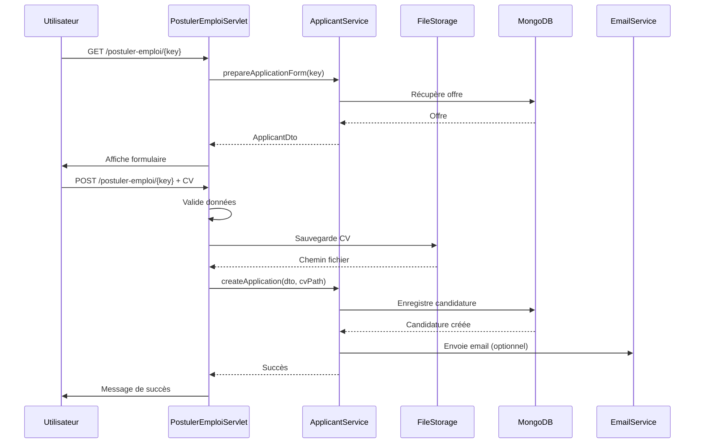

#### State Diagram
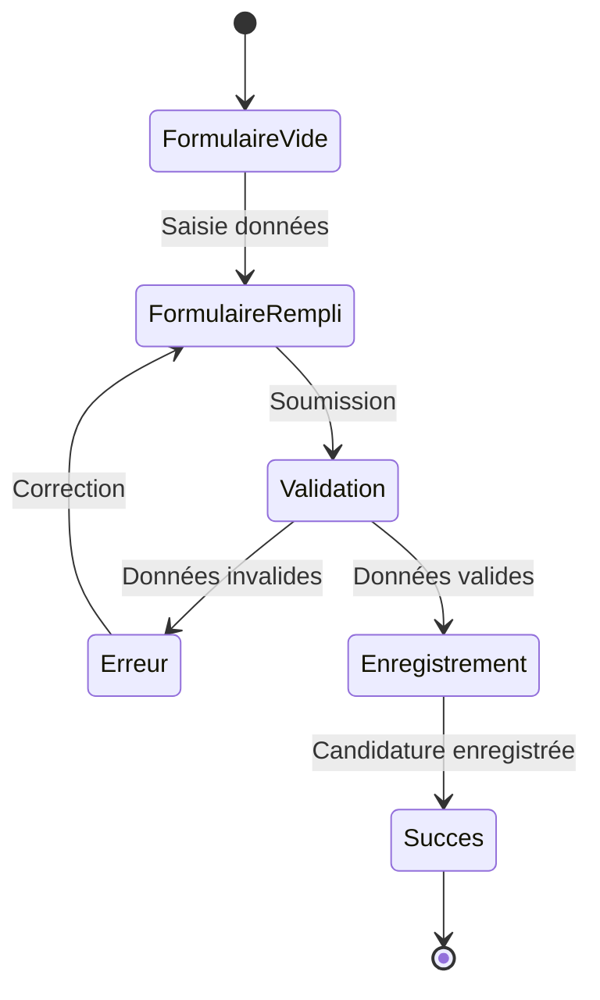

### Related Use Cases
- Includes: UC-004 (Consulter détail offre)
- Related: UC-006 (Publier offre)

---

## UC-006: Publier une offre d'emploi

### Metadata
- **ID**: UC-006
- **Name**: Publier une offre d'emploi
- **Priority**: High
- **Status**: Completed
- **Servlet**: AddJobOfferServlet

### Actors
- **Primary Actor**: Recruteur
- **Secondary Actors**: Système, Email Service

### Description
Un recruteur publie une nouvelle offre d'emploi sur le site en remplissant un formulaire avec les détails de l'offre.

### Preconditions
1. Le recruteur accède à la page de publication
2. Le recruteur dispose de toutes les informations nécessaires sur l'offre

### Postconditions
1. L'offre est créée en base de données
2. Un code secret unique est généré pour le recruteur
3. L'offre est visible sur le site
4. Un email avec le code secret est envoyé au recruteur

### Main Success Scenario
1. Le recruteur accède à "/ajouter-offre-emploi"
2. Le système affiche le formulaire avec la liste des domaines
3. Le recruteur remplit tous les champs requis (titre, description, email, téléphone, type de contrat, ville, domaine, etc.)
4. Le recruteur soumet le formulaire
5. Le système valide les données
6. Le système génère un code secret unique
7. Le système enregistre l'offre en base de données
8. Le système envoie un email avec le code secret
9. Le système affiche un message de succès avec le code secret

### Alternative Scenarios
- **A1**: Champs requis manquants → Erreurs de validation affichées, formulaire pré-rempli
- **A2**: Email invalide → Erreur de validation
- **A3**: Domaine invalide → Erreur de validation
- **A4**: Erreur lors de l'enregistrement → Message d'erreur, données conservées

### Business Rules
- BR-001: Les champs titre, contenu, email, téléphone, type, ville, domaine sont obligatoires
- BR-002: Le code secret est unique et généré automatiquement
- BR-003: L'email doit être au format valide
- BR-004: Le domaine doit exister dans la liste des domaines disponibles
- BR-005: L'offre est active par défaut après création

### Diagrams

#### Collaboration Diagram
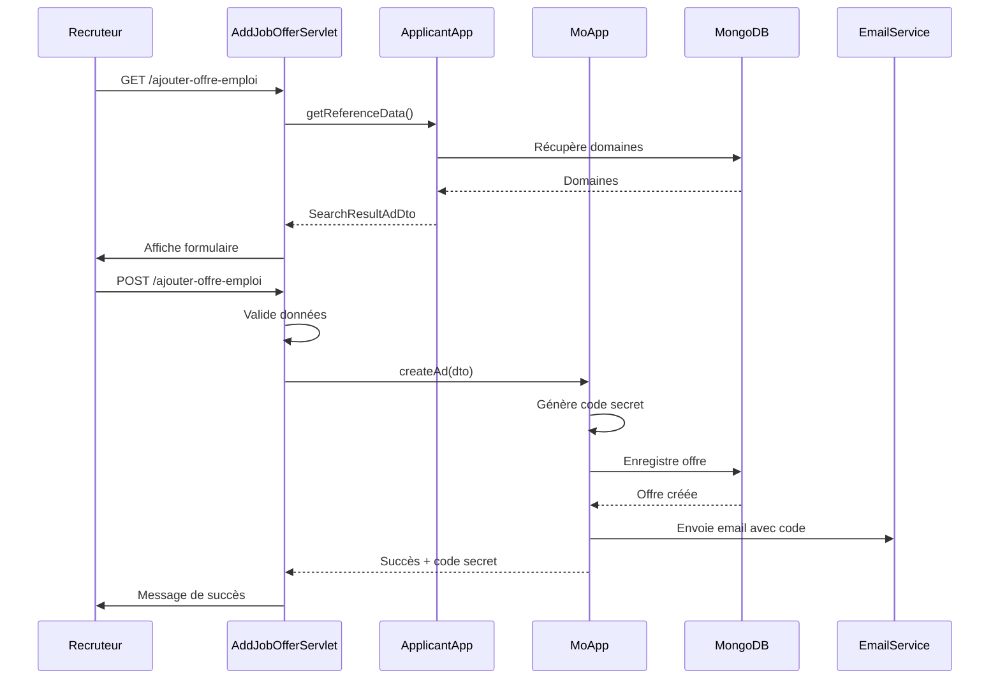

#### State Diagram
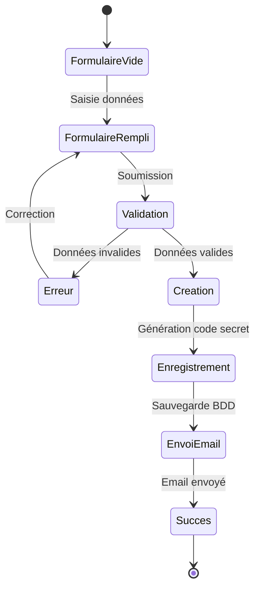

### Related Use Cases
- Extends: UC-007 (Gérer mes annonces)
- Related: UC-004 (Consulter détail offre)

---

## UC-007: Gérer mes annonces (Middle Office)

### Metadata
- **ID**: UC-007
- **Name**: Gérer mes annonces
- **Priority**: Medium
- **Status**: Completed
- **Servlet**: MyJobAdsListServlet, JobOfferUpdateServlet, JobOfferDeleteServlet

### Actors
- **Primary Actor**: Recruteur
- **Secondary Actors**: Système

### Description
Le recruteur gère ses offres d'emploi publiées en utilisant le code secret reçu lors de la création. Il peut consulter la liste, modifier ou supprimer ses annonces.

### Preconditions
1. Le recruteur possède un code secret valide
2. Au moins une offre existe pour ce code secret

### Postconditions
1. La liste des annonces est affichée OU
2. Une annonce est modifiée OU
3. Une annonce est supprimée

### Main Success Scenario

#### Sous-cas 7.1: Consulter la liste des annonces
1. Le recruteur accède à "/m-office/mes-annonces/{secretCode}"
2. Le système valide le code secret
3. Le système récupère toutes les annonces associées au code secret
4. Le système affiche la liste paginée des annonces

#### Sous-cas 7.2: Modifier une annonce
1. Le recruteur clique sur "Modifier" pour une annonce
2. Le système affiche le formulaire pré-rempli avec les données de l'annonce
3. Le recruteur modifie les champs souhaités
4. Le recruteur soumet le formulaire
5. Le système valide et enregistre les modifications
6. Le système affiche un message de succès

#### Sous-cas 7.3: Supprimer une annonce
1. Le recruteur clique sur "Supprimer" pour une annonce
2. Le système demande confirmation
3. Le recruteur confirme la suppression
4. Le système supprime l'annonce de la base de données
5. Le système affiche un message de succès

### Alternative Scenarios
- **A1**: Code secret invalide → Page d'erreur 403
- **A2**: Aucune annonce trouvée → Message "Aucune annonce disponible"
- **A3**: Tentative de modification d'une annonce d'un autre recruteur → Erreur 403
- **A4**: Données invalides lors de la modification → Erreurs de validation affichées

### Business Rules
- BR-001: Seul le propriétaire du code secret peut gérer ses annonces
- BR-002: La pagination affiche 10 annonces par page par défaut
- BR-003: La suppression est définitive
- BR-004: Les modifications doivent respecter les mêmes règles de validation que la création

### Diagrams

#### Use Case Diagram
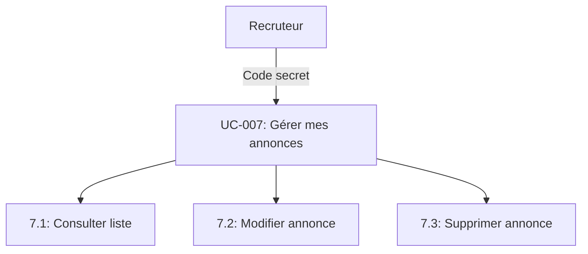

#### Collaboration Diagram
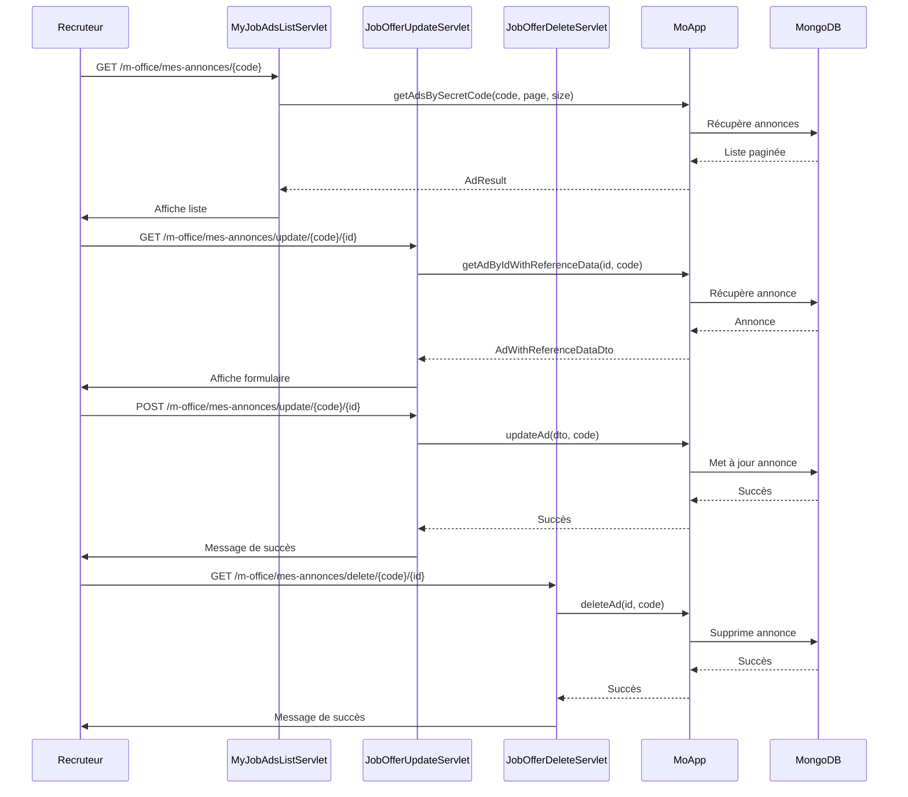

### Related Use Cases
- Includes: UC-006 (Publier offre)
- Related: UC-004 (Consulter détail offre)

---

## UC-008: Contacter le site

### Metadata
- **ID**: UC-008
- **Name**: Contacter le site
- **Priority**: Low
- **Status**: Completed
- **Servlet**: ContactServlet

### Actors
- **Primary Actor**: Visiteur, Candidat, Recruteur
- **Secondary Actors**: Système, reCAPTCHA, Email Service

### Description
Un utilisateur envoie un message de contact au site via un formulaire protégé par reCAPTCHA.

### Preconditions
1. L'utilisateur accède à la page de contact
2. reCAPTCHA est configuré

### Postconditions
1. Le message de contact est enregistré
2. Un email est envoyé aux administrateurs
3. Un message de confirmation est affiché à l'utilisateur

### Main Success Scenario
1. L'utilisateur accède à "/contact"
2. Le système affiche le formulaire de contact
3. L'utilisateur remplit les champs (nom, email, sujet, message)
4. L'utilisateur complète le reCAPTCHA
5. L'utilisateur soumet le formulaire
6. Le système valide le reCAPTCHA
7. Le système valide les données du formulaire
8. Le système envoie un email aux administrateurs
9. Le système affiche un message de succès

### Alternative Scenarios
- **A1**: reCAPTCHA invalide → Erreur "Veuillez valider le reCAPTCHA"
- **A2**: Champs requis manquants → Erreurs de validation
- **A3**: Email invalide → Erreur de validation
- **A4**: Erreur d'envoi d'email → Message d'erreur

### Business Rules
- BR-001: Tous les champs sont obligatoires
- BR-002: L'email doit être au format valide
- BR-003: Le reCAPTCHA doit être validé avant soumission
- BR-004: Les messages sont envoyés par email aux administrateurs

### Diagrams

#### Collaboration Diagram
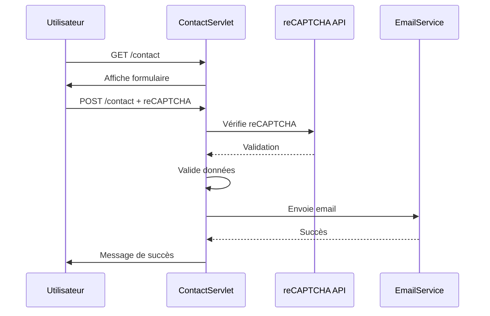

### Related Use Cases
- None

---

## UC-009: Consulter les mentions légales

### Metadata
- **ID**: UC-009
- **Name**: Consulter les mentions légales
- **Priority**: Low
- **Status**: Completed
- **Servlet**: MentionsServlet

### Actors
- **Primary Actor**: Visiteur
- **Secondary Actors**: Système

### Description
Un visiteur consulte la page des mentions légales du site.

### Preconditions
1. Le template des mentions légales existe

### Postconditions
1. La page des mentions légales est affichée

### Main Success Scenario
1. L'utilisateur accède à "/mentions"
2. Le système affiche la page des mentions légales

### Alternative Scenarios
- None

### Business Rules
- None

### Diagrams
- None (cas d'usage simple)

### Related Use Cases
- None

---

## UC-010: Consulter la page À propos

### Metadata
- **ID**: UC-010
- **Name**: Consulter la page À propos
- **Priority**: Low
- **Status**: Completed
- **Servlet**: AboutServlet

### Actors
- **Primary Actor**: Visiteur
- **Secondary Actors**: Système

### Description
Un visiteur consulte la page "À propos" du site pour en savoir plus sur Emplois Maroc.

### Preconditions
1. Le template "À propos" existe

### Postconditions
1. La page "À propos" est affichée

### Main Success Scenario
1. L'utilisateur accède à "/a-propos-emplois-maroc"
2. Le système affiche la page "À propos"

### Alternative Scenarios
- None

### Business Rules
- None

### Diagrams
- None (cas d'usage simple)

### Related Use Cases
- None

---

## Diagramme Général des Cas d'Usage

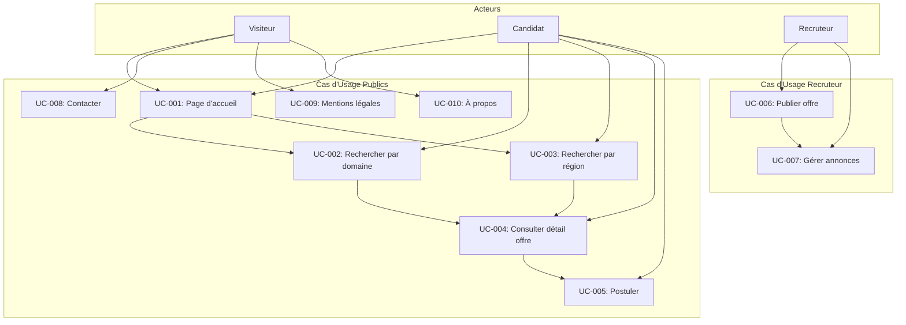

---

## Architecture - Service d'envoi d'emails

### Diagramme de classes

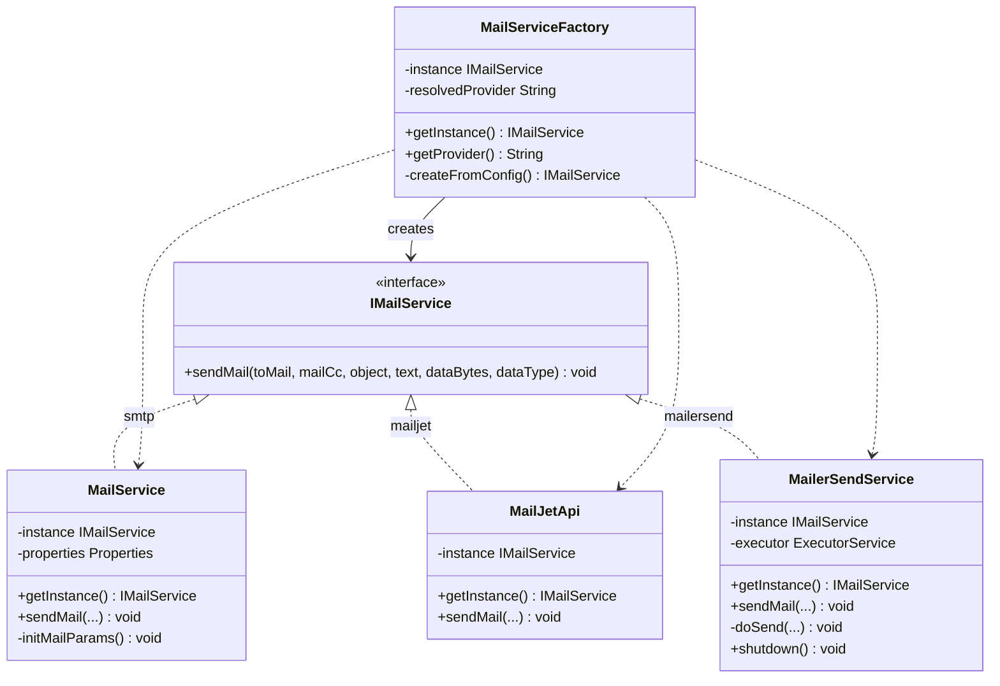

### Diagramme de sequence - Envoi asynchrone via MailerSend

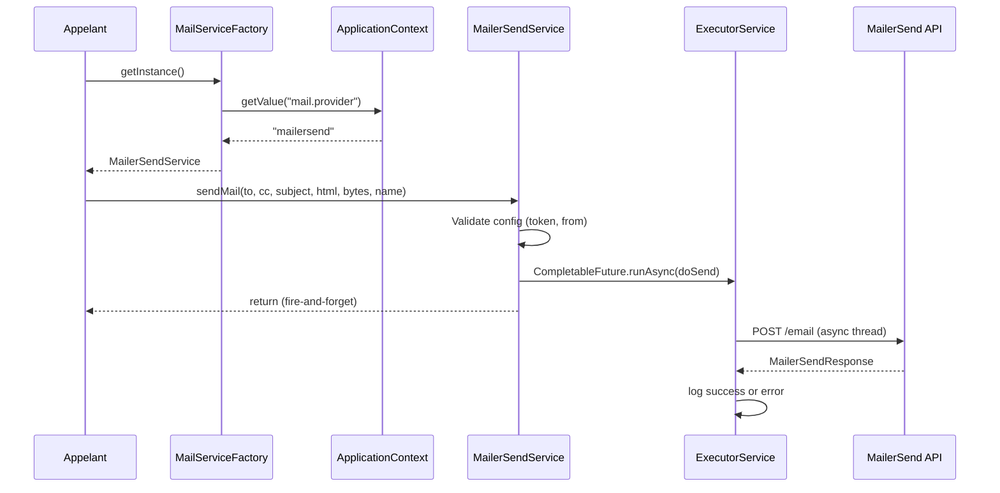

### Liste des emails envoyes par l'application

| Declencheur | Classe | Destinataire | Description |
|-------------|--------|-------------|-------------|
| Nouvelle annonce creee | MoApp | Admin (mail.to) | Notification a l'administrateur |
| Nouvelle annonce creee | MoApp | Recruteur (ad.email) | Confirmation de creation avec code secret |
| Annonce validee (front-office) | BaseApp | Recruteur (ad.email) | Confirmation de validation |
| Annonce validee (back-office) | BoApp | Recruteur (ad.email) | Confirmation de validation |
| Formulaire de contact soumis | MoApp | Admin (mail.to) | Message de contact transmis |
| Code secret demande | MoApp | Utilisateur (email) | Lien pour gerer les annonces |
| Candidature soumise | ApplicantApp | Employeur (ad.email) | Candidature avec CV en piece jointe |

### Configuration

Le provider d'email est configure dans les fichiers de proprietes :

```
# Valeurs possibles : smtp, mailjet, mailersend
mail.provider=smtp

# Configuration MailerSend
mailersend.token=<API_TOKEN>

# Configuration commune
mail.from=<EMAIL>
mail.from.name=<NOM>
```

---

## Notes

Ce document peut etre enrichi via des prompts pour:
- Ajouter de nouveaux cas d'usage
- Detailler les scenarios alternatifs
- Ajouter des regles metier
- Creer de nouveaux diagrammes
- Mettre a jour les relations entre cas d'usage
