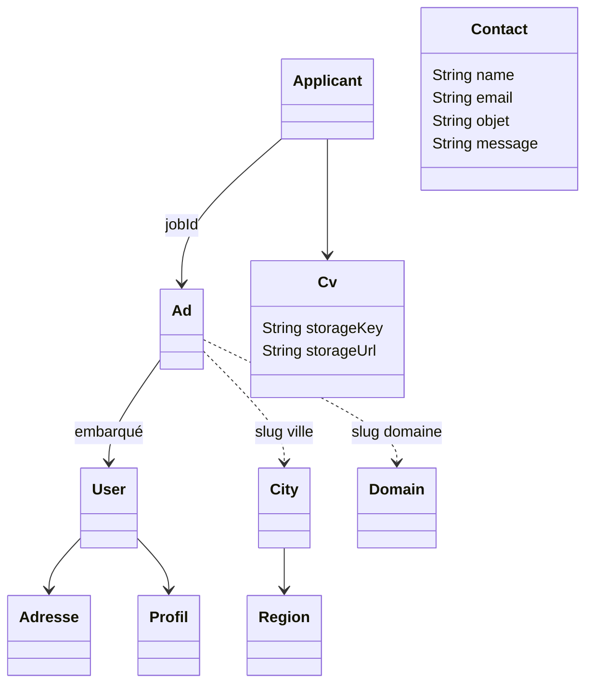
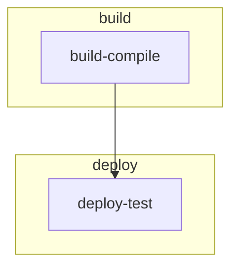

# Documentation complète de la structure du projet `emplois-maroc`

Ce document décrit intégralement la structure du projet, ses couches, ses fichiers de configuration, sa base de données, ses points d'entrée, ses tests, sa CI/CD, ses dépendances et ses assets.

## 1. ARBORESCENCE COMPLÈTE DES FICHIERS ET DOSSIERS

📂 `/`
- `.ai/` # Dossier de documentation / analyse interne, très probablement généré ou produit par des outils de documentation/IA (manuel / outil)
  - `.ai/CODEBASE_ANALYSIS.md` # Analyse de la base de code (manuel/outil)
  - `.ai/CONFIGURATION_GUIDE.md` # Guide de configuration complet (manuel/outil)
  - `.ai/docs/CONCEPTION.md` # Spécifications de conception (manuel/outil)
  - `.ai/docs/SPECIFICATION.md` # Spécifications fonctionnelles (manuel/outil)
  - `.ai/docs/TEST_CASES.md` # Cas de test (manuel/outil)
  - `.ai/ERROR_HANDLING_GUIDE.md` # Guide de gestion d'erreurs (manuel/outil)
  - `.ai/HOMEPAGE_ANALYSIS.md` # Analyse de page d'accueil (manuel/outil)
  - `.ai/HOMEPAGE_MIGRATION_GUIDE.md` # Guide de migration d'accueil (manuel/outil)
  - `.ai/MIGRATION_CHECKLIST.md` # Checklist de migration (manuel/outil)
  - `.ai/MIGRATION_QUICK_REFERENCE.md` # Référence rapide de migration (manuel/outil)
  - `.ai/NEXT_STEPS.md` # Prochaines étapes recommandées (manuel/outil)
  - `.ai/README.md` # Documentation de l'outil `.ai` (manuel/outil)
  - `.ai/REFACTORING_EXPLANATION.md` # Explication de refactorisation (manuel/outil)
  - `.ai/REFACTORING_SUMMARY.md` # Résumé de refactorisation (manuel/outil)
  - `.ai/SCSS_SETUP_GUIDE.md` # Guide SCSS (manuel/outil)
  - `.ai/SCSS_SETUP_SUMMARY.md` # Résumé SCSS (manuel/outil)
  - `.ai/TESTING_GUIDE.md` # Guide de tests (manuel/outil)
- `.gitignore` # Règles Git pour ignorer les fichiers locaux et générés (manuel)
- `.gitlab-ci.yml` # Pipeline GitLab CI/CD (manuel)
- `dependency-reduced-pom.xml` # Fichier généré par Maven Shade pour l’emballage (généré)
- `STRUCTURE_PROJET.md` # Ce document — structure complète du dépôt (manuel)
- `docs/` # Documentation utilisateur et technique du projet (manuel)
  - `docs/A_PROPOS_DU_PROJET.md` # Présentation du projet, objectifs métier, architecture et stack (manuel)
  - `docs/PIPELINE_ET_PRODUCTION.md` # Documentation déploiement et exploitation (manuel)
- `EMAILS_CIRCUIT.md` # Document de définition du flux d'e-mails métier (manuel)
- `PR_DESCRIPTION.md` # Modèle de description de Merge Request (manuel)
- `README.md` # Documentation principale du dépôt (manuel)
- `run-tests.ps1` # Script PowerShell Windows pour exécuter les tests Maven (manuel)
- `jetty/jetty-config.xml` # Configuration Jetty (manuel)
- `pom.xml` # Fichier Maven principal (manuel)
- `start_mongo_env.sample` # Exemple de variables pour démarrer MongoDB localement (manuel)
- `start_mongo.sh` # Script Bash de démarrage local de MongoDB (manuel)
- `stop_mongo.sh` # Script Bash d'arrêt de MongoDB localement (manuel)
- `src/` # Code source et ressources de l’application
  - `src/main/` # Code de production
    - `src/main/java/` # Code Java principal
      - `src/main/java/com/centoria/jobmaroc/` # Package racine de l’application
        - `app/` # Couches application / use cases métier
          - `ApplicantApp.java` # Gestion des candidatures et du formulaire de candidature (manuel)
          - `BaseApp.java` # Classe abstraite partagée pour les apps métier (manuel)
          - `BoApp.java` # Cas d’usage back-office / validation des annonces (manuel)
          - `IndexApp.java` # Cas d’usage page d’accueil et recherche générale (manuel)
          - `IQueryBuilder.java` # Interface pour construction de requêtes MongoDB dynamiques (manuel)
          - `LinksApp.java` # Cas d’usage génération de liens vers les annonces / pages SEO (manuel)
          - `MoApp.java` # Cas d’usage middle-office pour les annonceurs (manuel)
          - `ResultApp.java` # Cas d’usage de résultats de recherche et pages de liste (manuel)
          - `ZonePageApp.java` # Cas d’usage de pages de zone et contenus dynamiques (manuel)
        - `common/` # Utilitaires et contexte applicatif
          - `constants/ThemeConstants.java` # Constantes liées aux thèmes d’affichage (manuel)
          - `context/ApplicationContext.java` # Chargement configuration selon `EM_ENV` et accès global props (manuel)
          - `globalData/UrlConst.java` # Constantes d’URLs et routes (manuel)
          - `ihm/IWebExecutor.java` # Interface pour exécution de routeurs / contrôleurs (manuel)
          - `utils/LoadPagesZones.java` # Utilitaire de chargement de pages de zone depuis CSV (manuel)
          - `utils/MessageBundle.java` # Gestion des messages i18n / bundle de traduction (manuel)
          - `utils/ThemeHelper.java` # Aide pour choix du template en fonction du thème (manuel)
        - `dao/` # Accès aux données MongoDB
          - `AbstractSimpleGenericDao.java` # DAO générique CRUD MongoDB POJO (manuel)
          - `IAdDao.java` # Interface DAO pour `Ad` (manuel)
          - `IApplicantDao.java` # Interface DAO pour `Applicant` (manuel)
          - `ICityDao.java` # Interface DAO pour `City` (manuel)
          - `IContactDao.java` # Interface DAO pour `Contact` (manuel)
          - `ICvDao.java` # Interface DAO pour `Cv` (manuel)
          - `IDomainDao.java` # Interface DAO pour `Domain` (manuel)
          - `IRegionDao.java` # Interface DAO pour `Region` (manuel)
          - `ISimpleGenericDao.java` # Interface DAO générique CRUD (manuel)
          - `IUserDao.java` # Interface DAO pour `User` (manuel)
          - `IZonePageDao.java` # Interface DAO pour pages de zone (manuel)
          - `impl/` # Implémentations concrètes des DAO
            - `AdDao.java` # DAO `Ad` singleton (manuel)
            - `ApplicantDao.java` # DAO `Applicant` singleton (manuel)
            - `CityDao.java` # DAO `City` singleton (manuel)
            - `ContactDao.java` # DAO `Contact` singleton (manuel)
            - `CvDao.java` # DAO `Cv` singleton (manuel)
            - `DomainDao.java` # DAO `Domain` singleton (manuel)
            - `RegionDao.java` # DAO `Region` singleton (manuel)
            - `UserDao.java` # DAO `User` singleton (manuel)
            - `ZonePageDao.java` # DAO `ZonePage` singleton (manuel)
          - `mongodb/` # Connexion MongoDB et factory
            - `IMongoManager.java` # Interface de manager MongoDB (manuel)
            - `MongoDBManagerFactory.java` # Configuration de connexion MongoDB et codecs POJO (manuel)
        - `dto/` # Data Transfer Objects et mapping
          - `AbstractInputDTO.java` # Classe de base pour les DTO d’entrée (manuel)
          - `AbstractResultDto.java` # Classe de base pour les DTO de résultat (manuel)
          - `Ad/` # Sous-package DTO pour annonces
            - `InputSearchAd.java` # Requête de recherche d’annonces (manuel)
          - `AdDisplayDto.java` # DTO d’affichage d’une annonce (manuel)
          - `AdDto.java` # DTO synthétique d’annonce (manuel)
          - `AdResult.java` # Résultat de recherche d’annonces (manuel)
          - `AdWithReferenceDataDto.java` # DTO d’annonce enrichi des données de référence (manuel)
          - `ApplicantDto.java` # DTO de la candidature (manuel)
          - `city/InputSearchCity.java` # Requête de recherche de villes (manuel)
          - `ContactDto.java` # DTO pour le contact (manuel)
          - `domain/DomainDto.java` # DTO de domaine (manuel)
          - `domain/InputSearchDomain.java` # Requête de recherche de domaine (manuel)
          - `IInputDTO.java` # Interface de base pour DTO d’entrée (manuel)
          - `InputSearchAdDTO.java` # DTO de recherche d’annonce principal (manuel)
          - `IWithReferenceData.java` # Interface de DTO avec données de référence (manuel)
          - `LinkDTO.java` # DTO de lien SEO / navigation (manuel)
          - `MailDto.java` # DTO enveloppe d’e-mail (manuel)
          - `mapper/` # Convertisseurs entité ↔ DTO
            - `IMapper.java` # Interface de mapping (manuel)
            - `MapperAdDto.java` # Mapping `Ad` ↔ `AdDto` (manuel)
            - `MapperApplicantDto.java` # Mapping `Applicant` ↔ `ApplicantDto` (manuel)
            - `MapperDomainDto.java` # Mapping `Domain` ↔ `DomainDto` (manuel)
            - `MapperRegionDto.java` # Mapping `Region` ↔ `RegionDTO` (manuel)
          - `MoDto.java` # DTO Middle Office (manuel)
          - `RegionDTO.java` # DTO de région (manuel)
          - `SearchResultAdDto.java` # DTO résultat de recherche d’annonces (manuel)
          - `UserDto.java` # DTO utilisateur (manuel)
        - `model/` # Entités métier persistées
          - `AbstractModel.java` # Base persistante pour MongoDB avec `_id`, slug, dates, enabled (manuel)
          - `Activity.java` # Modèle d’activité métier (manuel)
          - `Ad.java` # Entité annonce d’emploi, attributs métier, statut `state`, secretCode (manuel)
          - `Adresse.java` # Adresse utilisateur / contact (manuel)
          - `Applicant.java` # Entité candidature reliée à une annonce (manuel)
          - `City.java` # Entité ville avec référence à `Region` (manuel)
          - `Contact.java` # Entité message contact (manuel)
          - `Cv.java` # Entité CV avec métadonnées de stockage S3 (manuel)
          - `Domain.java` # Entité domaine d’activité (manuel)
          - `PageZones.java` # Entité pages de zones dynamiques (manuel)
          - `Region.java` # Entité région (manuel)
          - `ZoneContent.java` # Contenu de zone (manuel)
          - `ZoneValue.java` # Valeurs de zone (manuel)
          - `exception/` # Exceptions métier et techniques
            - `BusinessException.java` # Exception métier (manuel)
            - `ElementNotFoundException.java` # Exception d’élément absent (manuel)
            - `TechnicalException.java` # Exception technique / DAO (manuel)
          - `security/` # Sécurité et utilisateurs
            - `Profil.java` # Entité profil utilisateur (manuel)
            - `User.java` # Entité utilisateur avec adresse, token, type social (manuel)
        - `service/` # Interfaces métier
          - `IAdService.java` # Service d’annonces (manuel)
          - `IApplicantService.java` # Service de candidatures (manuel)
          - `IBaseService.java` # Interface de service CRUD générique (manuel)
          - `ICityService.java` # Service de villes (manuel)
          - `ICvService.java` # Service CV (manuel)
          - `IDomainService.java` # Service de domaines (manuel)
          - `IMailService.java` # Service d’envoi d’e-mails (manuel)
          - `IRegionService.java` # Service de régions (manuel)
          - `IStorageService.java` # Service de stockage (S3 / local) (manuel)
          - `IUserService.java` # Service utilisateur (manuel)
          - `IZonePageService.java` # Service pages de zone (manuel)
          - `MailServiceFactory.java` # Usine pour choisir le provider d’e-mail (manuel)
          - `impl/` # Implémentations de service
            - `AdService.java` # Logique métier des annonces, tris BO, recherche, agrégation (manuel)
            - `ApplicantService.java` # Logique métier des candidatures (manuel)
            - `BaseService.java` # Implémentation de base CRUD déléguant au DAO (manuel)
            - `CityService.java` # Logique métier des villes et régions (manuel)
            - `CvService.java` # Gestion du CV et stockage (manuel)
            - `DomainService.java` # Logique métier des domaines (manuel)
            - `MailerSendService.java` # Envoi d’e-mails via API MailerSend (manuel)
            - `MailJetApi.java` # Envoi d’e-mails via Mailjet API (manuel)
            - `MailService.java` # Envoi d’e-mails SMTP via JavaMail + FreeMarker (manuel)
            - `RegionService.java` # Logic région / regroupement de villes (manuel)
            - `S3StorageService.java` # Stockage OVH S3 / AWS compatible (manuel)
            - `UserService.java` # Logique utilisateur (manuel)
            - `ZonePageService.java` # Logique pages de zones dynamiques (manuel)
        - `web/` # Couche web / HTTP
          - `base/` # Classes de base pour servlets et templates
            - `BaseController.java` # Contrôleur de base pour routes (manuel)
            - `FreeMarkerEngine.java` # Wrapper de rendu FreeMarker (manuel)
          - `bo/` # Back-office
            - `BoIndexServlet.java` # Servlet d’index du back-office (manuel)
          - `filter/` # Filtres HTTP / routeurs (legacy Spark, non branchés dans `Main.java`)
            - `FilterController.java` # Filtres commentés — migration Spark → Servlets (manuel)
          - `FrontController.java` # Ancien routeur Spark front — **non utilisé** (manuel, legacy)
          - `BoController.java` # Ancien routeur Spark back-office — **non utilisé** (manuel, legacy)
          - `MoController.java` # Ancien routeur Spark middle-office — **non utilisé** (manuel, legacy)
          - `handler/` # Gestion des erreurs HTTP
            - `CustomErrorHandler.java` # Gestionnaire d’erreur personnalisée FreeMarker (manuel)
          - `imageUpload/` # Support upload image
            - `ImageUpload.java` # Logique upload image (manuel)
            - `ImageValidator.java` # Validation image / format (manuel)
            - `servlets/IndexServlet.java` # Exemple de servlet de test d’image (manuel)
            - `Utils.java` # Utilitaires upload (manuel)
          - `Main.java` # Point d’entrée Jetty et enregistrement des servlets (manuel)
          - `MoController.java` # Routeur middle-office (manuel)
          - `servlet/` # Servlets front-end principaux
            - `AboutServlet.java` # Page à propos (manuel)
            - `AddJobOfferServlet.java` # Publication d’offre / multipart upload (manuel)
            - `BaseServlet.java` # Servlet de base partagée (manuel)
            - `CategoryByDomainServlet.java` # Liste par domaine / catégorie (manuel)
            - `CategoryServlet.java` # Page catégorie / domaine (manuel)
            - `CatgoryByDomainByCityServlet.java` # Liste domaine + ville (manuel)
            - `ContactServlet.java` # Formulaire de contact (manuel)
            - `DetailOfferServlet.java` # Détail d’annonce (manuel)
            - `I18nModel.java` # Modèle i18n pour templates (manuel)
            - `IndexServlet.java` # Page d’accueil (manuel)
            - `KaptchaServlet.java` # Génération CAPTCHA image (manuel)
            - `MentionsServlet.java` # Mentions légales (manuel)
            - `MyJobAdsServlet.java` # Redirection vers liens d’annonces (manuel)
            - `PostulerEmploiServlet.java` # Postuler à une offre avec upload CV (manuel)
            - `RegionByCityByDomainServlet.java` # Route région/villes/domaines (manuel)
            - `RegionByCityServlet.java` # Route région/villes (manuel)
            - `RegionServlet.java` # Routeur principal /region/* (manuel)
            - `RobotsServlet.java` # Route dynamique /robots.txt (manuel)
            - `StaticFileServlet.java` # Handler Jetty pour fichiers statiques /assets (manuel)
            - `TestMailServlet.java` # Servlet de test d’e-mail (manuel)
          - `servlet/mo/` # Middle office via code secret
            - `BaseJobServlet.java` # Classe de base middle-office (manuel)
            - `JobOfferDeleteServlet.java` # Suppression d’annonce middle-office (manuel)
            - `JobOfferUpdateServlet.java` # Édition d’annonce middle-office (manuel)
            - `MyJobAdsListServlet.java` # Liste des annonces middle-office (manuel)
          - `test/` # Servlets de test internes
            - `TestErrorServlet.java` # Servlet de test d’erreurs (manuel)
      - `src/main/java/google/recaptcha/` # Intégration Google reCAPTCHA
        - `Key.java` # Classe de clé reCAPTCHA (manuel)
        - `VerifyUtils.java` # Vérification serveur reCAPTCHA (manuel)
    - `src/main/resources/` # Ressources de l’application
      - `back-office/bo-index.ftl` # Template back-office classique (manuel)
      - `back-office-new/bo-index.ftl` # Template back-office nouvelle version (manuel)
      - `common/` # Fragments FreeMarker partagés classiques (manuel)
      - `common-new/` # Fragments FreeMarker partagés nouvelle version (manuel)
      - `config/` # Fichiers de configuration et robots
        - `config.local.properties` # Configuration locale (manuel, à ne pas committer)
        - `config.prod.properties` # Configuration de production (manuel)
        - `config.sample.properties` # Exemple de configuration (manuel)
        - `config.test.properties` # Configuration pour tests (manuel)
        - `logback.xml` # Configuration Logback (manuel)
        - `robots-local.txt`, `robots-prod.txt`, `robots-test.txt`, `robots.txt` # règles robots pour chaque environnement (manuel)
      - `DB/` # Données de seed et script de base
        - `applicants.json` # Données de candidatures initiales (manuel)
        - `cities.json` # Données de villes / slugs / populations (manuel)
        - `cv.json` # Données de CV initiales (manuel)
        - `dbScript.js` # Script MongoDB de peuplement / initialisation (manuel)
        - `domains.json` # Données de domaines d’activité (manuel)
        - `jobs.json` # Données d’annonces initiales (manuel)
        - `zonePage.csv` # Données de pages de zone dynamiques (manuel)
      - `emails/` # Modèles d’e-mail classiques (manuel)
      - `emails-new/` # Modèles d’e-mail nouvelle version (manuel)
      - `errors/` # Templates d’erreur classiques (manuel)
      - `errors-new/` # Templates d’erreur nouvelle version (manuel)
      - `front/` # Templates front classique (manuel)
      - `front-new/` # Templates front nouvelle version (manuel)
      - `i18n/` # Fichiers de traduction (manuel)
        - `messages_ar.properties` # Traductions arabe
        - `messages_fr.properties` # Traductions français
        - `messages.properties` # Traductions par défaut
      - `m-office/` # Templates middle-office classiques (manuel)
      - `m-office-new/` # Templates middle-office nouvelle version (manuel)
      - `public/` # Assets statiques servis tels quels
        - `assets/` # Style / JS / images classiques (manuel/généré)
          - `css/` # CSS source (manuel)
          - `css-min/` # CSS minifié (généré au build)
          - `js/` # JavaScript source (manuel)
          - `js-min/` # JS minifié (généré au build)
          - `fa/` # Font Awesome (manuel)
          - `fonts/` # Polices Roboto (manuel)
          - `img/` # Images du site (manuel)
        - `assets-theme/` # Assets de thème alternative (manuel/généré)
          - `css/` # CSS source thème (manuel)
          - `css-min/` # CSS minifié thème (généré au build)
          - `js/` # JS source thème (manuel)
          - `js-min/` # JS minifié thème (généré au build)
  - `src/main/webapp/` # Fichiers web additionnels
    - `META-INF/` # Métadonnées WAR (manuel)
    - `WEB-INF/` # Configuration d’application web standard (manuel)
    - `google7257dbe573ee69d3.html` # Vérification Google site ownership (manuel)
    - `sitemap.xml` # Sitemap statique (manuel)
  - `src/test/` # Tests automatisés
    - `src/test/java/com/centoria/jobmaroc/app/ApplicantAppTest.java` # Test unitaire du cas d’usage candidature (manuel)
    - `src/test/java/com/centoria/jobmaroc/test/AdDaoTest.java` # Test DAO `Ad` (manuel)
    - `src/test/java/com/centoria/jobmaroc/test/AdServiceTest.java` # Test service annonce (manuel)
    - `src/test/java/com/centoria/jobmaroc/test/ApplicantDaoTest.java` # Test DAO `Applicant` (manuel)
    - `src/test/java/com/centoria/jobmaroc/test/bdd/CucumberTestRunner.java` # Runner Cucumber JUnit 5 (manuel)
    - `src/test/java/com/centoria/jobmaroc/test/bdd/JobOfferStepDefinitions.java` # Step definitions BDD (manuel)
    - `src/test/java/com/centoria/jobmaroc/test/CityDaoTest.java` # Test DAO `City` (manuel)
    - `src/test/java/com/centoria/jobmaroc/test/integration/MongoDbIntegrationTestBase.java` # Base d’intégration MongoDB (manuel)
    - `src/test/java/com/centoria/jobmaroc/test/MoAppTest.java` # Test Middle Office (manuel)
    - `src/test/java/com/centoria/jobmaroc/test/RegionDaoTest.java` # Test DAO `Region` (manuel)
    - `src/test/java/com/centoria/jobmaroc/test/selenium/JobOfferSeleniumTest.java` # Test Selenium UI pour offres (manuel)
    - `src/test/java/com/centoria/jobmaroc/test/selenium/pages/BasePage.java` # Page object Selenium de base (manuel)
    - `src/test/java/com/centoria/jobmaroc/test/selenium/pages/JobOfferPage.java` # Page object Selenium d’offre (manuel)
    - `src/test/resources/config/config.integration.properties` # Propriétés d’intégration (manuel)
    - `src/test/resources/features/job_offer.feature` # Scénario BDD Cucumber (manuel)

> Note : `target/` et ses sous-dossiers ne sont pas listés car ils sont générés lors du build Maven et sont exclus par `.gitignore`.

---

## 2. STRUCTURE PAR COUCHE ARCHITECTURALE

| Couche | Dossiers concernés | Rôle | Fichiers clés |
|--------|-------------------|------|---------------|
| Présentation | `src/main/java/com/centoria/jobmaroc/web/`, `src/main/resources/front/`, `src/main/resources/public/`, `src/main/resources/back-office/` | Gère les requêtes HTTP, les routes, les servlets, le rendu HTML/templating, le contenu statique | `Main.java`, `IndexServlet.java`, `CategoryServlet.java`, `DetailOfferServlet.java`, `AddJobOfferServlet.java`, `PostulerEmploiServlet.java`, `StaticFileServlet.java`, templates `.ftl` |
| Application / Métier | `src/main/java/com/centoria/jobmaroc/app/`, `src/main/java/com/centoria/jobmaroc/service/`, `src/main/java/com/centoria/jobmaroc/dto/` | Encapsule la logique métier, les cas d’usage, la transformation des données, les règles métier | `IndexApp.java`, `MoApp.java`, `BoApp.java`, `AdService.java`, `ApplicantService.java`, `MailService.java`, `DomainService.java` |
| Accès aux données | `src/main/java/com/centoria/jobmaroc/dao/`, `src/main/java/com/centoria/jobmaroc/dao/mongodb/` | Communication avec MongoDB, opérations CRUD, requêtes et agrégations | `AbstractSimpleGenericDao.java`, `MongoDBManagerFactory.java`, `AdDao.java`, `CityDao.java`, `ApplicantDao.java` |
| Infrastructure | `src/main/resources/config/`, `pom.xml`, `.gitlab-ci.yml`, `start_mongo.sh`, `stop_mongo.sh`, `run-tests.ps1`, `jetty/jetty-config.xml` | Configuration technique, build, déploiement, pipeline, exécution du serveur et de la base | `pom.xml`, `.gitlab-ci.yml`, `config.sample.properties`, `ApplicationContext.java`, `logback.xml`, `start_mongo.sh` |
| Domaine / Entités | `src/main/java/com/centoria/jobmaroc/model/`, `src/main/resources/DB/` | Modèle de données métier, structure des objets persistés en MongoDB | `Ad.java`, `Applicant.java`, `City.java`, `Domain.java`, `Region.java`, `Cv.java`, `User.java`, `AbstractModel.java` |

---

## 3. DÉTAIL DES FICHIERS DE CONFIGURATION

### `pom.xml`
- Objectif : build Maven, packaging `jar`, dépendances de production et test, plugins de compilation, minification, tests et packaging.
- Options importantes :
  - `java.version=17` : compilation Java 17.
  - `maven-shade-plugin` : génère un JAR exécutable avec `mainClass=com.centoria.jobmaroc.web.Main`.
  - `maven-war-plugin` : exclut les fichiers publics du WAR.
  - `minify-maven-plugin` : minifie CSS/JS dans `src/main/resources/public/assets` et `assets-theme`.
  - `maven-compiler-plugin` : utilise Lombok et MapStruct comme annotation processors.
  - `maven-surefire-plugin` : exécute les tests avec `EM_ENV=test`.
- Comment le modifier :
  - Ajouter une dépendance doit être fait dans la section `<dependencies>`.
  - Éditer le `mainClass` ou le packaging si l’artefact évolue.
  - Modifier ou supprimer les phases de minification seulement si les chemins assets changent.

### `.gitlab-ci.yml`
- Objectif : pipeline GitLab CI/CD.
- Jobs :
  - `build-compile` : compilation et tests Maven.
    - Image : `maven:3.9.7-eclipse-temurin-17`.
    - Services : `mongo:6`.
    - Variables : `EM_MONGO_URI=mongodb://mongo:27017`.
    - Script : création des dossiers minifiés, `mvn -B clean install`.
    - Artefacts : `target/emploismaroc.jar`, `src/main/resources/config`.
  - `deploy-test` : déploiement vers un serveur de test via SSH & LXC.
    - Installe `rsync` et `openssh-client`.
    - Charge la clé SSH depuis `SSH_PRIV_KEY`.
    - Copie le JAR et la configuration vers le serveur.
    - Utilise `lxc file push` pour transférer et redémarrer le service `emploismaroc`.
    - Déclenchement : seulement sur la branche `main`.
- Comment le modifier :
  - Ajuster `tags` si les runners changent.
  - Modifier `image` pour une version Maven/JDK différente.
  - Mettre à jour les chemins d’artefacts si le build change.

### `config.sample.properties`
- Objectif : exemple de configuration pour l’environnement local ou de démarrage.
- Options importantes :
  - `repository.images` : chemin local de stockage des images.
  - `mail.*` : configuration SMTP / provider e-mail.
  - `db.cnnection.string` : URI MongoDB.
  - `server.port` : port HTTP.
  - `theme.name` : `""` pour thème par défaut, `new` pour thème alternatif.
  - `s3.*` : configuration OVH S3 (backup, stockage CV).
- Comment le modifier :
  - Copier en `config.local.properties` et adapter les valeurs locales.
  - Ne pas committer `config.local.properties`.

### `config.test.properties`
- Objectif : configuration dédiée aux tests.
- Options importantes :
  - `db.cnnection.string=mongodb://127.0.0.1:27017`.
  - `server.port=8081` : port utilisé pendant les tests.
  - `mail.provider=mailersend` : provider d’e-mail de test.
  - `mail.test.to` : destinataire de test pour `/test-mail`.
- Comment le modifier :
  - Utiliser uniquement pour les environnements de test.
  - Ajouter des identifiants temporaires si les tests doivent envoyer de vrais e-mails.

### `logback.xml`
- Objectif : configuration du logging Logback.
- Options :
  - `STDOUT` : appender console.
  - `root level="debug"` : niveau de log par défaut `debug`.
  - Logs `org.apache.hc.client5.http` réduits à `WARN`.
- Comment le modifier :
  - Pour exporter les logs en fichier, ajouter un `FileAppender`.
  - Pour réduire le bruit en production, changer le niveau racine à `INFO` ou `WARN`.

### `jetty/jetty-config.xml`
- Objectif : configuration Jetty externe pour le déploiement.
- Contenu : paramètres de serveur Jetty, ports, contextes (manuel/outil). Utilisé potentiellement en production.

### `run-tests.ps1`
- Objectif : script Windows pour exécuter `mvn -B clean test` sans config Maven PATH.
- Comment le modifier :
  - Ajuster les chemins vers Maven si nécessaire.
  - Ajouter des arguments Maven supplémentaires si besoin.

### `start_mongo.sh` / `stop_mongo.sh`
- Objectif : démarrage et arrêt d’une instance MongoDB locale en mode réplicaset.
- `start_mongo.sh` : installe MongoDB si nécessaire, démarre deux `mongod`, initie `rs.initiate()`.
- `stop_mongo.sh` : arrête tous les processus `mongod`.
- Comment le modifier :
  - Adapter `INSTALL_DIR`, `MONGO_ARCHIVE`, `MONGO_ARCHIVE_DIR` dans `start_mongo_env.sh`.

### `.gitignore`
- Objectif : ignorer les fichiers générés et locaux.
- Règles importantes :
  - `target/`, `.idea/`, `.project`, `.classpath`, `.settings/`, `emploismaroc.iml`.
  - Configurations locales : `config.local.properties`, `src/main/resources/config/config.local.properties`, `src/main/resources/config/config.dev.properties`, `src/main/resources/config/config.staging.properties`.
  - Répertoires générés par la minification : `src/main/resources/public/assets/css-min/`, `src/main/resources/public/assets/js-min/`, `src/main/resources/public/assets/img/companies/`.

---

## 4. STRUCTURE DES BASES DE DONNÉES

### Modèle de données MongoDB
La persistance est gérée par MongoDB en mode document, avec des entités POJO mappées via le codec POJO MongoDB.

#### Collections principales
- `job` : stocke les `Ad` (annonces d’emploi).
- `applicant` : stocke les `Applicant` (candidatures).
- `city` : stocke les `City`.
- `region` : stocke les `Region`.
- `domain` : stocke les `Domain`.
- `contact` : stocke les `Contact` des formulaires.
- `cv` : stocke les métadonnées des CV.
- `user` : stocke les `User`.
- `zone` : stocke les `PageZones` (pages de zone dynamiques, voir `PageZones.getCollectionName()`).
- `activity` : journal d’activité métier (`Activity`).

#### Entités et champs

##### `Ad` (`job`)
- `key` : identifiant MongoDB `_id`.
- `user` : `User` embarqué.
- `title`, `img`, `content`, `email`, `phone`, `companyName`, `companyCode`.
- `secretCode` : code secret de gestion de l’annonce.
- `password` : mot de passe potentiellement utilisé pour la gestion.
- `type`, `experienceLevel`, `formation`, `nbrDePostes`, `confidentiality`.
- `city` : slug de ville.
- `domain` : slug de domaine.
- `state` et `stateRank` : statut de l’annonce (`new`, `valid`, `updated`, etc.).
- `announcetype` : type d’annonce (`NORMAL`, `STAR`, `SCRAPPY`, etc.).
- `lastActivityAt`, `creationDate`, `updateDate`.

##### `Applicant`
- `key`, `nom`, `prenom`, `email`, `motivation`, `experienceLevel`, `formation`, `phone`, `state`, `stateRank`.
- `jobId` : référence à l’annonce.
- `password` : mot de passe de candidature.
- `cv` : objet `Cv` embarqué.

##### `City`
- `key`, `name`, `pays`, `codePays`, `slug`, `population`.
- `region` : objet `Region` embarqué.

##### `Region`
- `key`, `name`, `slug`.

##### `Domain`
- `key`, `name`, `slug`, `population`, `icon`.

##### `Contact`
- `key`, `name`, `email`, `phone`, `objet`, `message`.

##### `Cv`
- `key`, `email`, `storageKey`, `storageUrl`.
- `cvFile` : champs byte[] non persisté (`@BsonIgnore`), utilisé pour upload en mémoire.

##### `User`
- `key`, `otherId`, `firstName`, `lastName`, `tel`, `mail`, `password` (transient), `authToken`, `profilId`, `profil`, `adresse`, `abonne`, `valid`, `validationKey`, `lat`, `lng`, `socialType`.

##### `AbstractModel`
- Champs communs : `key`, `creationDate`, `updateDate`, `code`, `label`, `description`, `slug`, `enabled`.

### Seeders et données initiales
- `src/main/resources/DB/applicants.json` # jeux de données de candidatures.
- `src/main/resources/DB/cities.json` # villes et slugs.
- `src/main/resources/DB/cv.json` # métadonnées CV.
- `src/main/resources/DB/domains.json` # domaines d’activité.
- `src/main/resources/DB/jobs.json` # annonces d’emploi de test.
- `src/main/resources/DB/dbScript.js` # script MongoDB d’initialisation.
- `src/main/resources/DB/zonePage.csv` # données de pages de zone.

### Diagramme Mermaid des relations

> Remarque : il n’y a pas de jointures SQL classiques. Les relations sont principalement implémentées par référence de slug / codes et quelques objets embarqués.

---

## 5. POINTS D'ENTRÉE DE L'APPLICATION

### Fichier principal
- `src/main/java/com/centoria/jobmaroc/web/Main.java`
  - Vérifie la compatibilité Jetty EE10.
  - Charge la configuration via `ApplicationContext.getInstance().getProps()`.
  - Initialise FreeMarker.
  - Enregistre les servlets et routes dans `ServletContextHandler`.
  - Crée des handlers statiques pour `/assets` et `/assets-theme`.
  - Démarre Jetty sur le port `server.port`.

### Explication par blocs
- `verifyJettyCompatibility()` : contrôle la présence des classes Jetty EE10 et signale une incompatibilité.
- `ApplicationContext.getInstance().getProps()` : charge le fichier `config/config.{env}.properties` selon `EM_ENV`.
- `ensureTestReferenceData()` : en environnement `test`, insère des villes et un domaine si la collection est vide.
- Configuration FreeMarker : `Configuration.VERSION_2_3_31`, chargement de templates depuis le classpath `/`.
- `ServletContextHandler` : registre les servlets les plus spécifiques avant le `IndexServlet`.
- `MultipartConfigElement` : fixe les limites d’upload 5 Mo / 10 Mo pour `AddJobOfferServlet` et `PostulerEmploiServlet`.
- Routes critiques :
  - `/robots.txt` → `RobotsServlet`
  - `/rtsystems_admin_8965_hXtwWUCzukqwPyEuWxcE` → `BoIndexServlet`
  - `/m-office/mes-annonces/*` → middle-office
  - `/categorie/*` → catégorie / domaine
  - `/ajouter-offre-emploi` → création d’annonce
  - `/contact` → contact
  - `/a-propos-emplois-maroc` → à propos
  - `/mentions` → mentions légales
  - `/postuler-emploi/*` → candidature (multipart)
  - `/offre-emploi-maroc/*` → détail offre
  - `/test-mail` → test e-mail
  - `/captcha-image` → génération CAPTCHA
  - `/` → `IndexServlet`

### Commandes de démarrage
- `mvn clean install` : compile, teste et package l’application.
- `java -jar target/emploismaroc.jar` : lance l’application via Jetty embarqué.
- `./start_mongo.sh` : démarre MongoDB local en réplicaset.
- `./stop_mongo.sh` : arrête MongoDB local.
- `./run-tests.ps1` : exécute les tests Maven sur Windows.

### Variables d’environnement requises
| Variable | Obligatoire | Exemple | Rôle |
|----------|-------------|---------|------|
| `EM_ENV` | optionnelle | `prod`, `test`, `local` | Sélectionne `config/config.{env}.properties`; par défaut `local` |
| `CONFIG_DIR` | optionnelle | `/etc/emploismaroc` | Permet de charger `robots-*.txt` externes en production |
| `server.port` | optionnelle dans config | `8080` | Port HTTP du serveur Jetty |
| `db.cnnection.string` | obligatoire dans config | `mongodb://localhost:27017` | URI MongoDB |
| `mail.provider` | requis selon e-mail | `smtp`, `mailjet`, `mailersend` | Sélection du provider d’e-mail |
| `SSH_PRIV_KEY` | requis pour CI deploy | clé SSH privée | Authentification SSH de déploiement GitLab |
| `SERVER_TEST_IP` | requis pour CI deploy | `192.0.2.1` | IP du serveur de test |
| `SSH_TEST_USER` | requis pour CI deploy | `debian` | Utilisateur SSH pour déploiement |
| `EM_MONGO_URI` | requis en CI build | `mongodb://mongo:27017` | URI MongoDB du service GitLab CI |

> La plupart des variables métier et techniques sont définies dans les fichiers `src/main/resources/config/config.*.properties`.

---

## 6. ORGANISATION DES TESTS

### Dossiers de tests
- `src/test/java/com/centoria/jobmaroc/app/` : tests unitaires des classes app.
- `src/test/java/com/centoria/jobmaroc/test/` : tests unitaires et d’intégration.
- `src/test/java/com/centoria/jobmaroc/test/bdd/` : tests BDD Cucumber.
- `src/test/java/com/centoria/jobmaroc/test/selenium/` : tests UI Selenium.
- `src/test/resources/` : ressources de test, configuration et scénarios Cucumber.

### Fichiers de test clés
- `ApplicantAppTest.java` : test du workflow de candidature.
- `AdDaoTest.java` : test CRUD DAO annonce.
- `AdServiceTest.java` : test des règles métier d’annonces.
- `ApplicantDaoTest.java` : test CRUD DAO candidature.
- `CityDaoTest.java` : test DAO ville.
- `RegionDaoTest.java` : test DAO région.
- `MoAppTest.java` : test Middle Office.
- `MongoDbIntegrationTestBase.java` : base pour tests d’intégration Mongo.
- `CucumberTestRunner.java` : exécution Cucumber JUnit 5.
- `JobOfferStepDefinitions.java` : étapes BDD de scénario d’offre.
- `JobOfferSeleniumTest.java` : test Selenium de la page d’offre.

### Frameworks utilisés
- `JUnit 5` : `junit-jupiter`, `junit-platform-suite-api`, `junit-platform-suite-engine`.
- `Mockito` : `mockito-core`, `mockito-junit-jupiter`.
- `Cucumber` : `cucumber-java`, `cucumber-core`, `cucumber-junit-platform-engine`.
- `Selenium` : `selenium-java`.
- `WebDriverManager` : gestion automatique des drivers Selenium.

### Commandes de test
- `mvn -B clean test` : exécute tous les tests unitaires et d’intégration.
- `./run-tests.ps1` : même commande sur Windows via PowerShell.
- `mvn -B clean install` : compile et package après exécution des tests.

---

## 7. PIPELINE CI/CD INTÉGRÉ

### GitLab CI (`.gitlab-ci.yml`)
- Stages : `build`, `deploy`.

#### Job `build-compile`
- Image : `maven:3.9.7-eclipse-temurin-17`.
- Services : `mongo:6`.
- Variables : `EM_MONGO_URI=mongodb://mongo:27017`.
- Étapes :
  - création des dossiers `css-min` et `js-min`.
  - `mvn -B clean install`.
- Artefacts :
  - `target/emploismaroc.jar`.
  - `src/main/resources/config`.
- Expiration artefacts : `10 mins`.

#### Job `deploy-test`
- Image : `debian:11`.
- `before_script` : installe `rsync`, `openssh-client`, configure SSH sans vérification d’hôte.
- Script :
  - transfert du JAR et des fichiers de config sur le serveur via `scp`.
  - utilisation de `lxc file push` pour déposer l’artefact dans le container `emploi-maroc`.
  - redémarrage du service systemd `emploismaroc` et vérification de l’état.
- Déclencheur : `only: main`.

### Schéma Mermaid du pipeline

---

## 8. DÉPENDANCES (librairies)

### Dépendances principales (production)
| Librairie | Rôle | Utilisation dans le code |
|-----------|------|--------------------------|
| `org.eclipse.jetty:jetty-server` | Serveur HTTP embarqué | Démarrage du serveur Jetty dans `Main.java` |
| `org.eclipse.jetty.ee10:jetty-ee10-servlet` | Support Servlet EE10 | Servlets et handlers Jetty |
| `jakarta.servlet:jakarta.servlet-api` | API Servlet | Signature des servlets |
| `org.mongodb:mongodb-driver-sync` | Driver MongoDB sync | Accès MongoDB dans `MongoDBManagerFactory` et DAO |
| `org.mongodb:bson` | BSON / Codec MongoDB | Sérialisation des POJO MongoDB |
| `org.freemarker:freemarker` | Moteur de template | Rendu des pages `.ftl` |
| `ch.qos.logback:logback-classic` | Logging | Journaux d’exécution |
| `jodd-props` | Chargement de propriétés | `ApplicationContext` |
| `com.google.code.gson:gson` | JSON | Conversion JSON si besoin |
| `com.fasterxml.jackson.core:jackson-databind` | JSON | `AbstractModel.toJson()` / `fromJson()` |
| `software.amazon.awssdk:s3` | S3 / OVH storage | Stockage de fichiers CV sur S3 compatible |
| `com.mailjet:mailjet-client` | Envoi e-mail Mailjet | `MailJetApi` |
| `com.mailersend:java-sdk` | Envoi e-mail MailerSend | `MailerSendService` |
| `com.sun.mail:javax.mail` | SMTP email | `MailService` |
| `com.github.slugify:slugify` | Génération de slugs | Génération de URLs / slugs dans le code |
| `com.github.penggle:kaptcha` | CAPTCHA | `KaptchaServlet` |
| `net.coobird:thumbnailator` | Manipulation d’images | Upload / traitement d’images |
| `com.opencsv:opencsv` | Lecture CSV | Chargement de `zonePage.csv` |
| `org.apache.commons:commons-text` | Text utilities | Nettoyage / normalisation de texte |
| `org.apache.commons:commons-io` | IO helpers | Gestion de fichiers et flux |
| `org.apache.commons:commons-math3` | Math utilities | Calculs éventuels, non critique |
| `org.antlr:ST4` | StringTemplate | Possiblement utilisé pour templating avancé |

### Dépendances de développement / test
| Librairie | Rôle |
|-----------|------|
| `org.junit.jupiter:junit-jupiter` | Framework de test unitaires JUnit 5 |
| `org.mockito:mockito-core` | Mocking en tests |
| `org.mockito:mockito-junit-jupiter` | Intégration Mockito/JUnit |
| `org.junit.platform:junit-platform-suite-api` | Suite de tests JUnit 5 |
| `org.junit.platform:junit-platform-suite-engine` | Exécution suite de tests |
| `io.cucumber:cucumber-junit-platform-engine` | Exécution Cucumber JUnit 5 |
| `io.cucumber:cucumber-core` | Moteur Cucumber |
| `io.cucumber:cucumber-java` | Step definitions Cucumber |
| `org.seleniumhq.selenium:selenium-java` | Tests UI Selenium |
| `io.github.bonigarcia:webdrivermanager` | Gestion automatique des drivers Selenium |

### Utilisation critique
- `Jetty` est utilisé pour héberger l’application et enregistrer toutes les servlets.
- `MongoDB driver sync` est la couche d’accès principal à MongoDB depuis les DAO.
- `FreeMarker` rend les templates `.ftl` des pages front et back.
- `jodd-props` lit les fichiers de configuration selon `EM_ENV`.
- `MailJet` / `MailerSend` / `JavaMail` sont tous supportés, choisis via `mail.provider`.
- `S3 SDK` est utilisé pour l’upload / stockage de fichiers CV sur OVH.

---

## 9. DOSSIERS SPÉCIFIQUES

### `public/` et `assets/`
- `src/main/resources/public/assets/` : fichiers servis sous `/assets`.
- `src/main/resources/public/assets-theme/` : thème alternatif servi sous `/assets-theme`.
- Contenu : CSS, CSS minifié, JS, JS minifié, polices, images.
- `StaticFileServlet` utilise ces dossiers comme base de ressources et permet le fallback entre source et classpath.

### `assets/` et `assets-theme/`
- `css/` : styles sources.
- `css-min/` : fichiers minifiés créés par Maven (généré).
- `js/` : scripts sources.
- `js-min/` : scripts minifiés créés par Maven (généré).
- `img/`, `fonts/`, `fa/` : assets statiques.

### `scripts/`
Il n’y a pas de dossier `scripts/`, mais les scripts utilitaires sont à la racine :
- `start_mongo.sh`
- `stop_mongo.sh`
- `run-tests.ps1`
- `start_mongo_env.sample`

### `docs/`
- Contient la documentation projet destinée aux utilisateurs et aux opérateurs.

### `logs/`
- Aucun dossier `logs/` n’existe dans le dépôt.
- Le logging est géré via `logback.xml` et s’écrit par défaut sur la console.

### `temp/` / `tmp/`
- Aucun dossier `temp/` ou `tmp/` spécifique n’est versionné.
- Les fichiers temporaires pour le multipart sont créés via `java.io.tmpdir` à l’exécution.

---

## 10. LIENS ENTRE FICHIERS

### Fonctionnalité 1 : page d’accueil
`Main.java` → `IndexServlet.java` → `IndexApp.java` → `AdService.java` / `DomainService.java` / `CityService.java` → `AdDao.java` / `DomainDao.java` / `CityDao.java` → MongoDB (`job`, `domain`, `city`).

### Fonctionnalité 2 : publication d’une offre
`Main.java` → `AddJobOfferServlet.java` → `ApplicantApp.getReferenceData()` (formulaire GET) / `MoApp.addOrUpdate()` (POST) → `AdService` → `AdDao` → MongoDB `job`.

### Fonctionnalité 3 : candidature à une offre
`Main.java` → `PostulerEmploiServlet.java` → `ApplicantApp.java` → `ApplicantService.java` → `ApplicantDao.java` → MongoDB `applicant`.

### Fonctionnalité 4 : validation back-office
`Main.java` → `BoIndexServlet.java` → `BoApp.java` → `AdService.java` → `AdDao.java` → MongoDB `job`.

### Fonctionnalité 5 : recherche par domaine / région
`Main.java` → `CategoryServlet.java` / `RegionServlet.java` → `ResultApp.java` ou `LinksApp.java` → `AdService.java` / `CityService.java` / `DomainService.java` → `AdDao.java` / `CityDao.java` / `DomainDao.java`.

---

## 11. FICHIERS IGNORÉS (`.gitignore`)

### Ce qui est ignoré
- `target/` : builds Maven générés.
- `.idea/`, `.project`, `.classpath`, `.settings/`, `emploismaroc.iml` : fichiers IDE locaux.
- `config.local.properties` et fichiers de configuration locaux : éviter de committer des secrets.
- `src/main/resources/public/assets/css-min/`, `src/main/resources/public/assets/js-min/` : fichiers minifiés générés.
- `src/main/resources/public/assets/img/companies/` : assets générés ou volumineux.
- `dependency-reduced-pom.xml` : artefact Maven Shade généré.

### Ce qui pourrait manquer
- Le dossier `target/classes` est implicitement couvert par `target/`.
- Il peut être utile d’ajouter explicitement `*.log` si des logs de développement apparaissent.
- Si des fichiers temporaires supplémentaires sont générés en local (`*.tmp`, `*.swp`, `.DS_Store`), il faudrait les ajouter.

---

## 12. Observations importantes

- Les routes actives sont enregistrées dans **`Main.java`** (servlets Jetty). `FrontController`, `BoController`, `MoController` et `FilterController` sont des reliquats de l’ancienne stack Spark (code commenté).
- Cette application est structurée comme une application Java web traditionnelle non Spring : elle utilise Jetty embarqué et des servlets explicites.
- La persistance MongoDB est gérée via un DAO générique personnalisée (`AbstractSimpleGenericDao`).
- La configuration est environnementale via `EM_ENV` et `ApplicationContext`.
- Les templates FreeMarker sont organisés en versions classiques et `-new`, avec un thème alternatif configurable.
- La CI deploy utilise SSH + LXC pour copier l’artefact vers une machine de test et redémarrer le service systemd.
- Les fichiers `css-min/` et `js-min/` sont générés localement à chaque build et doivent rester exclus du contrôle de version si la build est correctement exécutée.

---

## Raccourcis d’accès
- Point d’entrée : `src/main/java/com/centoria/jobmaroc/web/Main.java`
- Configuration : `src/main/resources/config/config.sample.properties`
- Build : `pom.xml`
- CI/CD : `.gitlab-ci.yml`
- Base de données : `src/main/java/com/centoria/jobmaroc/model/` et `src/main/resources/DB/`
- Tests : `src/test/java/`
